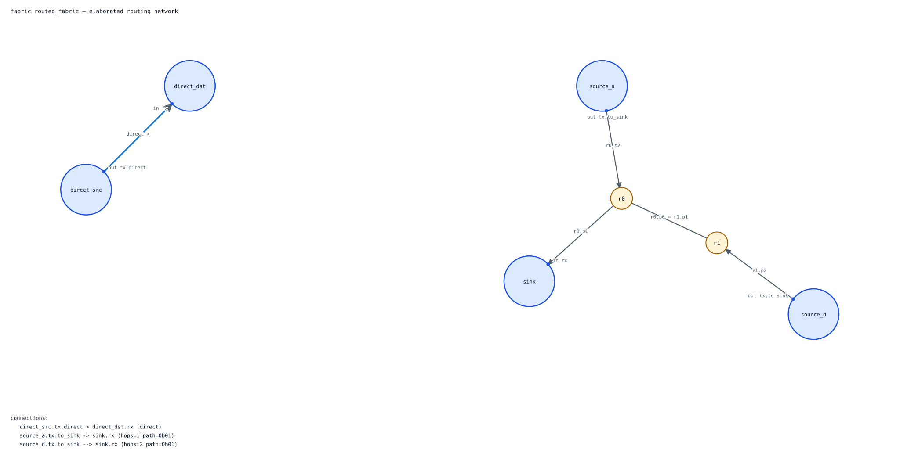

# Pigen

Pigen (short for **pi**peline **gen**erator) is a SystemVerilog extension for
building synchronous, flow-controlled hardware. It makes data transfer a
first-class part of the language.

The aim is an ennicening of Verilog. The hardware is still there: widths,
clocks, storage, timing boundaries and cycle behaviour remain explicit. What
Pigen takes away is the repeated ready/valid bookkeeping that tends to bury the
actual design.

Pigen compiles `.pigen` files to readable, synthesizable SystemVerilog. It is
pre-release, but already implements transfers, elastic pipelines, queues,
state machines and routed fabrics.

## The transfer is the fundamental unit

In Pigen, `<=` means **transfer this value**.

```systemverilog
outgoing <= incoming;
```

That transfer happens on a clock edge if `incoming` is valid and `outgoing` is
ready. Otherwise nothing happens: the source is not consumed and the
destination is not changed.

This rule does not depend on whether either end is a wire, register, buffer,
port, FIFO or skid buffer. Those are all sources and destinations of the same
operation. They differ in their ready/valid behaviour and in the storage they
imply, but they do not require different assignment operators or different
control structures.

This is the central idea of Pigen. A wire and a FIFO are very different pieces
of hardware, but a transfer involving either means the same thing. The
handshake may be tied high, last one cycle, or remain stalled for ten cycles;
the surrounding logic does not need a special case.

Here is a complete elastic path:

```systemverilog
module packet_path
    (
        input  logic        clk,
        input  logic        reset,
        input  buf [31:0]   incoming,
        output buf [31:0]   outgoing
    );

    reg  [31:0] decoded;
    skid [31:0] timing_break;
    fifo [31:0][8] pending;

    always_ff @(posedge clk) begin
        decoded      <= incoming;
        timing_break <= decoded;
        pending      <= timing_break;
        outgoing     <= pending;
    end
endmodule
```

Each line says what moves where. Pigen generates the occupancy bits, enables,
backpressure and queue control needed to make it true.

## One operation, several transport behaviours

Pigen calls the storage and handshake policy of a value its *transport kind*.
The name is not especially sacred; the distinction it describes is important.

| Kind | Valid behaviour | Ready behaviour | What it is |
| --- | --- | --- | --- |
| `wire` | Always valid | Never a destination | An always-offered combinational value |
| `reg` | Always valid | Always ready | A persistent registered value; reading it does not consume it |
| `buf` | Valid when occupied | Ready when it can accept | A one-entry elastic register |
| `port` | A one-cycle pulse | Always ready | A registered result offered for one cycle |
| `fifo` | Valid when non-empty | Ready when non-full | An ordered, depth-N queue |
| `skid` | Valid when non-empty | Ready when non-full | A two-entry skid buffer with registered backpressure |

Ordinary SystemVerilog `logic` behaves like `reg` in this model. `wire` and
`reg` are the degenerate cases: neither needs flow-control state, but both take
part in the same transfer language as `buf`, `port`, `fifo` and `skid`.

The transport kind is a local implementation choice. Pigen's intended module
interface reflects that: an input may optionally request a particular kind,
but an unqualified input is still emitted with payload, valid and ready. The
module does not need to know whether its caller connected a wire, a register or
a queue. It only needs to know whether a value is present and whether it can be
accepted. This generic-input form is planned rather than implemented today.

## Transfers compose

The handshake applies to a whole expression, not one operand at a time:

```systemverilog
result <= sample * coefficient + bias;
```

This waits until all three inputs are valid and `result` is ready, then consumes
the inputs together. Pigen treats it as one atomic join.

Concatenation gives the corresponding way to join, split and co-slice values:

```systemverilog
packet <= {header, body};
{opcode, payload} <= packet;
{upper, lower} <= {wide_packet[15:8], wide_packet[7:0]};
```

The last two examples are each one transfer and one consumption of the source,
even though several destinations receive pieces of it. Every destination must
be ready before anything moves. This is how one token can be deliberately
partitioned or duplicated into correlated outputs without accidentally
creating several independent consumers.

For related updates that are clearer as statements, a transfer block says the
same thing explicitly:

```systemverilog
transfer begin
    output_packet <= result;
    history       <= result;
end
```

The block fires as a unit. Either both destinations accept the value or neither
does.

By default, a buffered transport has one producer and one consumer. That rule
is what makes backpressure and token ownership unambiguous. Multiple syntactic
routes are allowed when Pigen can prove they are mutually exclusive; deliberate
fan-out belongs in one co-sliced transfer or transfer block, where its atomicity
is visible.

## Control can ask whether a transfer happened

Ordinary `if`, `else` and `case` statements can guard transfers. Pigen also
provides a compact form for the common case where control should advance only
when a value really moved:

```systemverilog
if (destination <= source) begin
    count <= count + 1;
end
```

This performs the transfer and enters the branch on the cycle it is accepted.
It is the operational counterpart of `accepts(destination, source)`, and avoids
writing a transfer in one place and a subtly different handshake test in
another. `valid`, `ready`, `accepts`, `peek`, `validate`, `invalidate` and
`flush` are available when control logic needs to inspect or manage transport
state directly.

## Pipeline blocks

A `pipeline` block describes a sequence of elastic packet transformations:

```systemverilog
pipeline filter begin
    int[16] sample, product, result;

    stage begin
        sample <= input_sample;
    end
    stage begin
        product <= sample * coefficient;
    end
    stage begin
        result <= product + bias;
    end

    yield result;
endpipeline

output_sample <= filter;
```

Pipeline fields travel with the packet. Every `stage` introduces an elastic
boundary, and `yield` exposes the final result as another buffered transfer
source. Stalls propagate through the pipeline automatically; a stage only
advances when all of the values it needs are present and the next stage can
accept them.

The example uses Pigen's intended data-first declaration syntax, described
below. The current compiler's pipeline syntax uses ordinary SystemVerilog types
inside the block.

## FSM blocks

An `fsm` is not a different model of hardware. It is the familiar synchronous
state register and `case` statement, with the boilerplate pulled out and
transfers left in their natural form:

```systemverilog
fsm sender @(posedge clk) reset (reset) initial idle
begin
    state idle:
    begin
        if (start)
            goto send;
    end

    state send:
    begin
        if (destination <= source)
            goto idle;
    end
end
```

States, reset behaviour and transitions are explicit. The useful difference is
that the state machine speaks the same transfer language as the datapath: it
can wait on validity, readiness or an accepted transfer without rebuilding the
handshake by hand.

## Fabric blocks

A `fabric` connects module endpoints while keeping routing out of the modules
themselves:

```systemverilog
fabric system_bus #(
    parameter integer PAYLOAD_W = 32
) begin
    dma.tx   >  memory.dma_rx;
    cpu.tx   -> memory.rx;
    debug.tx --> memory.rx;
endfabric
```

`>` is a direct exclusive link. The routed forms build deterministic buffered
interconnect and arbitrate where routes meet. Endpoints remain ordinary
single-producer, single-consumer ready/valid interfaces; they do not need to
know the topology or carry magic routing metadata.

Pigen generates an SVG from the same topology used to generate the RTL:



Use `--diagram PATH` to choose the SVG path or `--no-diagram` to suppress it.

## SystemVerilog remains SystemVerilog

Pigen is an extension to SystemVerilog, not a replacement HDL. Modules, ports,
parameters, packed and unpacked arrays, expressions, functions, testbenches and
ordinary procedural logic remain available. Pigen constructs can sit beside
plain SystemVerilog, so a design can use them where they help without requiring
the whole codebase to be rewritten.

There is a strict compatibility contract: accepted non-Pigen SystemVerilog
retains its widths, signedness, scheduling, reset and cycle behaviour when
processed by Pigen. Pigen syntax may change freely while the project is young;
unrelated SystemVerilog does not.

## Data types and transport kinds

Pigen is moving toward separating what a value *is* from how it *moves*. The
intended declaration order is data type, optional transport kind, then name:

```systemverilog
int[16] buf  x;
int[16] buf  arr[8];
uint[24] fifo samples[64];
bit     port finished;
byte         tag;
```

`int[n]`, `uint[n]`, `bit` and `byte` are the first planned data types. `[n]`
means an `n`-bit value and lowers to SystemVerilog's `[n-1:0]`; array dimensions
remain after the name. Ordinary declarations such as
`logic [21:0] h[0:12];` keep their usual SystemVerilog meaning.

The current compiler still uses transport-first declarations such as
`buf [31:0] packet`. The data-first syntax and generic module inputs will
replace that form once their frontend and type rules are complete. Pigen is
pre-release, so there will be one clean language rather than two Pigen
dialects.

## Build and try it

A C compiler and `make` are enough to build Pigen. The full verification suite
also uses Icarus Verilog and Verilator.

```sh
make
./pigen design.pigen -o generated.sv
./pigen network.pigen -o network.sv --diagram network.svg
make verify
```

Generated designs use the small primitives in
[`rtl/pigen_primitives.sv`](rtl/pigen_primitives.sv).

Useful places to continue:

- [`USER_GUIDE.md`](USER_GUIDE.md) is a practical guide to the currently
  implemented language.
- [`SPEC.md`](SPEC.md) is the precise language and SystemVerilog compatibility
  contract.
- [`examples`](examples) contains small designs for buffers, joins, queues,
  ports, skid stages and larger datapaths.
- [`agent_notes/COMPILER_ARCHITECTURE.md`](agent_notes/COMPILER_ARCHITECTURE.md)
  records the compiler architecture and migration plan.

## Compiler direction

The compiler is being moved from a working source-rewriting prototype to a
structured frontend and semantic middle. Source, syntax, names, types,
expressions, clock domains, transfers and ownership are represented explicitly;
pipelines, FSMs and fabrics will all lower through those shared semantics to an
elastic RTL representation and then SystemVerilog.

That work is in progress. The current compiler is useful, but Pigen should be
treated as an experimental language whose syntax and generated implementation
will continue to change.

## Development and AI

Pigen is designed and directed by David. AI coding agents are used extensively
for implementation, testing, documentation, code review and architectural
exploration. Their work is reviewed against the intended language semantics,
the specification and the verification suite; the direction and taste of the
project remain human decisions.
